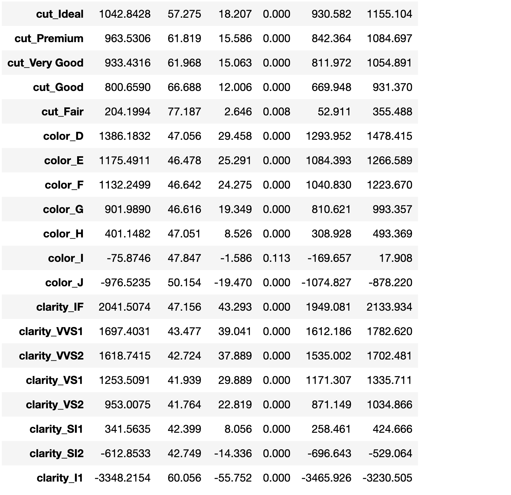
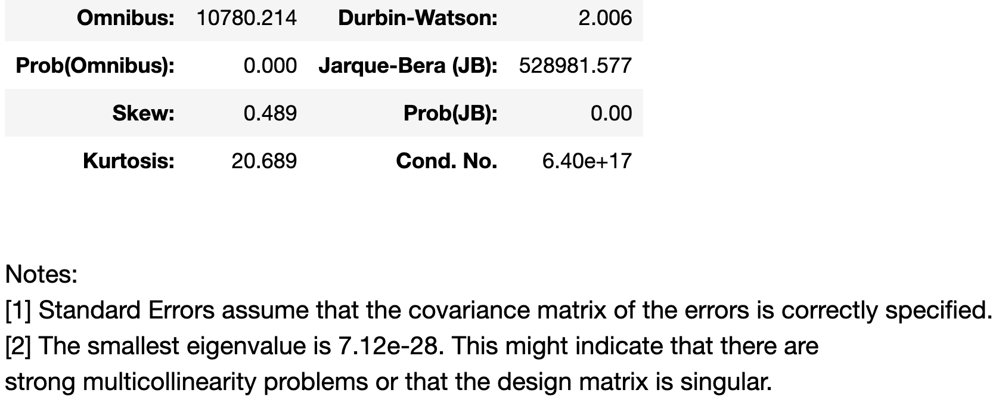

# Final Project - Diamonds 💎 are forever... but is their value? 🧐

## Presentation

### Selected topic
### Reason why they selected their topic
### Description of their source of data
### Questions they hope to answer with the data
### Description of the data exploration phase of the project
### Description of the analysis phase of the project
### Technologies, languages, tools, and algorithms used throughout the project
### Slides Presentations are drafted in Google Slides.

## Github
Main branch should include:
### All code necessary to perform exploratory analysis
### Most code necessary to complete the machine learning portion of the project
README.md README.md must include:
### Description of the communication protocols has been removed
### Cohesive, structured outline of the project (this may include images, but should be easy to follow and digest)
### Link to Google Slides draft presentation

Note: The descriptions and explanations required in all other project deliverables should also be in your README.md as part of your outline, unless otherwise noted. Individual Branches
### At least one branch for each team member
### Each team member has at least four commits for the duration of the third segment
(12 total commits per person)

## Machine Learning

### Provenance and schema of data 
Provisional data was obtained from the kaggle dataset [Diamonds Prices](https://www.kaggle.com/datasets/nancyalaswad90/diamonds-prices?select=Diamonds+Prices2022.csv) created by Ms. Nancy Al Aswad, which was scraped from the [Loose diamonds search engine at DiamondSearchEngine](https://www.diamondse.info/diamond-prices.asp) on July 9, 2022. The dataset contains 53,943 records of round-cut diamonds. (Round-cut diamonds represent about 72% of all diamonds listed on DiamondSE.info.) Each record has nine features (`carat`, `cut`, `color`, `clarity`, `depth`, `table`, `x`, `y`, `z`) and one target (`price`). 
- `carat` ranges from 0.2 to 5.01. 1 carat = 200 mg.
- `cut` grade has five categories: Fair, Good, Very Good, Premium, and Ideal.
- `color` has seven categories: D/E/F/G/H/I/J.
- `clarity` has eight categories: IF/VVS1/VVS2/VS1/VS2/SI1/SI2/I1. There are no flawless (FL) diamonds in this dataset.
- `depth` is the table depth which ranges from 0% to 90%.
- `table` is the table width which ranges from 0% to 90%.
- Regarding the 'depth' and 'table' features, 
please see [Understanding Diamond Table and Depth](https://www.brilliance.com/education/diamonds/depth-table?creative=617868835387&keyword=%2Bwhat%20%2Bdiamond%20%2Btable&matchtype=b&network=g&device=c&gclid=CjwKCAjw2OiaBhBSEiwAh2ZSP2pOhrNc4qaEWmpQvkH5PlLWDC-Z2_WX98YcHipvfzp_CEodbSIN4xoCM88QAvD_BwE).
- `x` is the length of the diamond in mm.
- `y` is the width of the diamond in mm.
- `z` is the depth of the diamond in mm.
- `price` is the price of the diamond in $USD set by the jeweler.

### Exploratory data analysis (EDA)

All of the EDA was done via the pandas_profiling ProfileReport module. An interactive report was generated in [EDA.ipynb](./EDA.ipynb) which provided an efficient and thorough means to explore the data set.

Bullet points of EDA highlights

TODO a few images?

### Description of data preprocessing
- There are no missing values to address.
- There are zeros in x, y, and z, which can be considered missing numbers (no diamonds have a zero length, width, or depth). All y zeros have x zeros, and all x zeros have z zeros.
    - All rows (8 rows) with x zeros were removed.
    - All rows with non-zero x and y values, but zero z values (12 rows) had z values calculated: `z = (depth / 100) * (x + y) / 2`.
- Feature selection by binning occurs at this step (see details below).
- For modelling, the categorical variables need to be converted to numerical variables. Here we used the get_dummies() function, which replaces the original categorical column with as many new numerical columns as there were categories. 
    - For example, `cut` has five categories, Fair, Good, Very Good, Premium, and Ideal. The column `cut` is removed, and five new columns are added: `cut_Fair`, `cut_Good`, `cut_Very Good`, `cut_Premium`, and `cut_Ideal`. If in row `i` the original value of `cut` was Good, then in row `i` new column `cut_Good` is assigned a value of 1, and the other columns are assigned a value of 0. 
    - The categorical columns `color` and `clarity` are treated likewise.
    - In this way, the three original categorical columns are replaced by 20 new numerical columns, increasing the model feature count by 17.
- The new numerical columns generated by get_dummies() were reordered by diamond trait quality in descending order for ease of analysis.
    - `cut_Ideal`, `cut_Premium`, `cut_Very Good`, `cut_Good`, `cut_Fair`
    - `color_D`, `color_E`, `color_F`, `color_G`, `color_H`, `color_I`, `color_J`
    - `clarity_IF`, `clarity_VVS1`, `clarity_VVS2`, `clarity_VS1`, `clarity_VS2`, `clarity_SI1`, `clarity_SI2`, `clarity_I1`

### Description of feature engineering and the feature selection, including their decision making process
Initially there is no feature selection. All features (dummy variables are considered features) are included in the model, as there is no reason to exclude any feature.

There are several feature selections that can be made by binning. The purpose of binning is to reduce feature complexity in the model, removing relatively rare features by combining them together into a single category. 
- Although there are only 5 cut categories, one could bin together the two lowest frequency categories, GOOD (9.1%) and FAIR (3.0%).
- Although there are only 7 color categories, one could bin together the two highest color lowest frequency categories I (10.1%) and J (5.2%).
- Although there are only 8 clarity categories, one could bin together the two lowest frequency clarities, I1 (1.4%) and IF (3.3%), not with each other, but with their nearest clarity category. That is, bin I1 and SI2 (17.0%), and bin IF and VVS1 (6.8%).

After model training, it may be the case that some features do not contribute meaningfully to the model (see below as to how to assess significance of fit), and removal of those features may improve model performance.

### Description of how data was split into training and testing sets
In order to assess the performance of a machine learning model, all the data is split into a training set and a testing set. The two sets are mutually exclusive. The model is then trained with the training set data. The important consideration is the accuracy of predictions obtained when the trained model is exposed to unseen test data. Why?

One can choose a very flexible model that when trained fit the training data very well. In some cases one could choose a "perfect model" that passes through every training data point! However, when exposed to unseen test data, this "perfect model" does poorly at predicting unseen test data. This condition is known as overfitting.

In the end, we want a model that can most accurately predict new or unseen data.

In practice, experience has shown that the best results can be obtained by having the size of the training data set be larger than that of the test data set. Here we used the sklearn.model_selection train_test_split() function to split the data as 75% training and 25% testing.

### Data Scaling
The data in this study was not scaled for the ordinary least squares multivariate regression model.

For some machine learning models, data scaling improves model training and subsequent predictive performance.

This is not the case for ordinary least squares multivariate regression modelling. Moreover, by not scaling the data, the feature coefficients of the trained model can be used to interpret the trained model fit.

### Explanation of model choice, including limitations and benefits

### Explanation of changes in model choice (if changes occurred between the Segment 2 and Segment 3 deliverables)

The choice of model did not change from last week.

### Description of how they have trained the model thus far, and any additional training that will take place

### Description of current accuracy score
- Significance of training coefficient estimates. 

- Accuracy of model

Additionally, the model obviously addresses the question or problem the team is solving.

## Database
### N/A

## Dashboard
### Images from the initial analysis
### Data (images or report) from the machine learning task
### At least one interactive element
