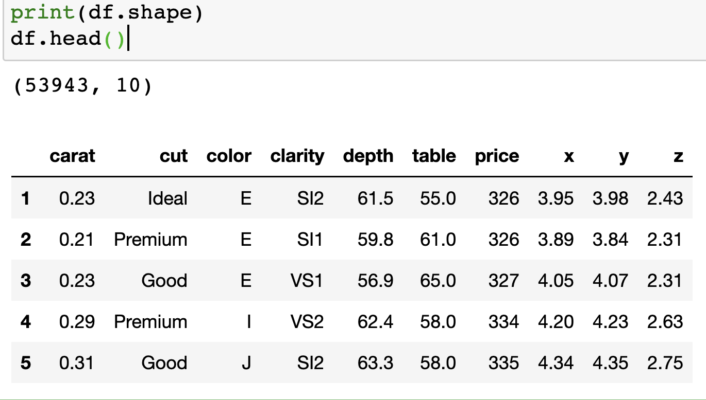
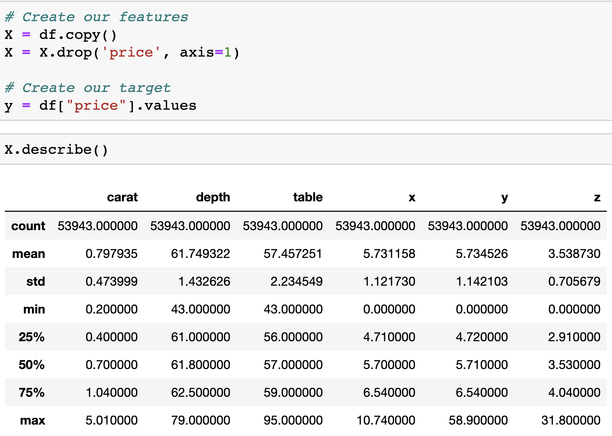

# Final Project - **Diamonds 💎 are forever... but is their value? 🧐**

### Overview 
Diamonds have a variety of measurable characteristics that contribute to the overall value of the diamond itself. This study is a supervised learning problem because each diamond and it's features are associated with a target price. As a group of data scientists, we are interested in analyzing the measurements and classifications of a diamond to understand the numerical value in the year 2022. 

### Source a dataset that will suit your needs (you can even use multiple datasets if applicable).

Link from diamondse tab 
- https://www.diamondse.info/diamond-prices.asp
- https://www.kaggle.com/datasets/nancyalaswad90/diamonds-prices

## Role Definitions: 
- Square: The team member in the square role will be responsible for setting up the repository. This includes naming the repository and adding team members.

- Triangle: The team member in the triangle role is responsible for creating a simple machine learning model. Creating a simple model this early in the design process helps a team better understand where and how a machine learning model will fit into the project. 

- Circle: The team member in the circle role is in charge of the mockup database. This means you're using a SQL-based database, including an ERD of the database and a document pointing out how it is integrated into your database and how it works with the code. You'll need to use either sample data or even fabricated data to test it. 

- X: The team member in the X role will focus on the technology side of the project. Consider these questions: Which tools are the best fit for your project? What will be used for each section? For example, data cleaning and data storage will be completed using two different tools. 

## Segment 1 (Week 1)

### Roles
- Square: Chauntel
	- Created and added a new repository 
	- Completed adding team to newly created repository
	- Pushed my personal branch to the GitHub
	- Drafted test readme and will push and combine/compare to the main branch
	- Received the following links to use for the project. These links outline parsing and what functions we could utilize for parsing/linear models:
		* https://stackoverflow.com/questions/34451518/how-to-obtain-field-names-of-rss-feedxml-file-in-python-dynamically-using-feed
		* http://napitupulu-jon.appspot.com/posts/diamonds-analysis.html

- **Triangle: Graeme**

    - **Provenance and schema of data.** Provisional data was obtained from the kaggle dataset [Diamonds Prices](https://www.kaggle.com/datasets/nancyalaswad90/diamonds-prices?select=Diamonds+Prices2022.csv) created by Ms. Nancy Al Aswad, which was scraped from the [Loose diamonds search engine at DiamondSearchEngine](https://www.diamondse.info/diamond-prices.asp) on July 9, 2022. The dataset contains 53,943 records of round-cut diamonds. Each record has nine features (`carat`, `cut`, `color`, `clarity`, `depth`, `table`, `x`, `y`, `z`) and one target (`price`). 
        - `carat` ranges from 0.2 to 30.0.
        - `cut` grade has three categories: Good, V.Good, and Ideal.
        - `color` has nine categories: D/E/F/G/H/I/J/K/L.
        - `clarity` has ten categories: FL/IF/VVS1/VVS2/VS1/VS2/SI1/SI2/I1/I2.
        - `depth` is the table depth which ranges from 0% to 90%. This feature should be renamed `table_depth`.
        - `table` is the table width which ranges from 0% to 90%. This feature should be renamed `table_width`.
        - Regarding the 'depth' and 'table' features, 
        please see [Understanding Diamond Table and Depth](https://www.brilliance.com/education/diamonds/depth-table?creative=617868835387&keyword=%2Bwhat%20%2Bdiamond%20%2Btable&matchtype=b&network=g&device=c&gclid=CjwKCAjw2OiaBhBSEiwAh2ZSP2pOhrNc4qaEWmpQvkH5PlLWDC-Z2_WX98YcHipvfzp_CEodbSIN4xoCM88QAvD_BwE).
        - `x` is the length of the diamond in mm.
        - `y` is the width of the diamond in mm.
        - `z` is the depth of the diamond in mm.
        - `price` is the price of the diamond in $USD set by the jeweler.

    - **Description of Data Preprocession.** 
    The data is well formatted. 
    It is recommended that the field 'depth' 
    is renamed 'table_depth' for clarity.
    It is recommended that the field 'table' 
    is renamed 'table_width' for clarity.

    - **Description of feature engineering and the feature selection, 
    including the team's decision-making process.** 
    All the features in the dataset are well delineated and independant 
    of each other. As a team, we agree to use 
    `carat`, `cut`, `color`, `clarity`, `table_depth`, `table_width`,
    `x`, `y`, and `z` as model features.
    
    - **Input data from the provisional database.** See file [import_provisional_data](https://github.com/telwoo/final-project/blob/graemet/segment1/import_provisional_data.ipynb).

    - **Outputs (target) label for input (features) data.**
The field `price` is the model target.

---

- **Circle: Matt** As the team member in the circle role, I was responsible with mocking up a database. I utilized the online tool for building an ER diagram from www.quickdatabasediagrams.com to produce a schema for our single table database and used PGadmin within a postgresql database to store the data locally.
    - Created ERD showing single table for Diamond data
    - Created schema.sql to create database table within PGadmin
    - Created queries.sql to remove index column once data is imported

- **X: Suchitra** ⬅ 🧐
    - **Created and added a repository**
    - **As a team, we aligned on utlizing the following tools: Python, Googlecolab/Jupyter Notebook, and PgAdmin.** 
    - **Initially we will be reading in a CSV > then we will read the CSV into a postgres database > then we will read from the postgres database into what we will be doing > lastly we will be using Jupyter Notebook/Google Colab.** 
    - **Identified two datasets**
      - https://www.diamondse.info/diamond-prices.asp
      - https://www.kaggle.com/datasets/nancyalaswad90/diamonds-prices

## Segment 2 (Week 2)

### Google Slides Presentation Link
Link to [Google Slides](https://docs.google.com/presentation/d/1XJpQY-igD12Sf8y8fvGjSy90BnF5JdpsV4NLWPnvuMo/edit#slide=id.g17d5b46eb50_0_244). 

### Roles
Square:
Graeme:
- Description of Preliminary Data Preprocessing:
        - Initially, as we conducted the preliminary data processing we recognized the data is originally formatted sufficiently.
    - Description of preliminary feature engineering and preliminary feature selection, including the team's decision-making process
        - As a team we have aligned on using the following as model features: carat, cut, color, clarity, table_depth, table_width, x, y, and z. All of the following features in the dataset are well defined and are not dependent of each other.
        - get_dummies was used to convert categorical features (cut, color, and clarity) to numerical features for model input.

Suchitra:

**Description of how data was split into training and testing sets**
- We utilized the sklearn.model_selection library to import then split, train and test the data. This allowed 75% of our data to be training data and 25% to be test data.
- Utilized StandardScaler() to scale the features prior to modelling.

**Explanation of Model Choice, including limitations and benefits**
- Linear regression is a classic method to model our dataset, and it is more understandable to our intended audience and less expensive computationally than other modeling methods.

	- Triangle: 
		- Matt: For Triangle role database updates please refer to resouces and PGadmin folders
		- Chauntel:  
			- This role is responsible for transforming the mockup database created in Segment 1 into a full database that 				 		integrates into our current work, related to diamond pricing based on different features. The nine features we're utilizing 				(carat, cut, color, clarity, depth, table, x, y, z, price) is defined in Segment 1, under the Triangle role. 
				- Disclaimers: 
					- For all column category definitions, please refer to Segment 1, Triangle role briefing.
					- Our main source of data was "Diamonds_Prices2022.csv."
			- The database we decided to use was PGAdmin
				- PGAdmin is simple to use and manipulate the needed data provided by our csv. 
				- PGAdmin allows us to have a clean and clear interface which helps us in building the necessary queries.
				- PGAmin was chosen over other databases because it was more manageable to integrate information into and out of. 
			- After we created a main database within PostgresSQL 11 (named "Diamonds_Price_Data"), we completed the following:
				1. We performed this function: SELECT DISTINCT * for the following features: cut, clarity, color. This function allowed 				us to get the specific, non-numerical categories with those specified columns.
					* We were able to determine that:
						- Cut column has 5 categories
						- Color column has 7 categories
						- Clarity column has 8 categories 
				2. Came to the conclusion that since cut had a higher impact on diamond price, and fewer category options, determined 					that cut would be the best choice for table comparisons. 
					- Reminder, cut choices are: Fair, Good, Very Good, Ideal, and Premium
				3. Created 5 tables, based on the cut of the diamond
				4. Used full outer join to merge together two tables: fair and premium, and good and very good. 
					* Decided to use Full Outer Join, because it would return all matching records from both tables whether the 						other tables' values completely match or not. Even though the categories have different values within the 						different features, the columns are the same (making it easier to merge). 
				5. Used connection string, SQLAlchemy to migrate our data
					* Choose SQLAlchemy because is very simple to implement and allows us to easily allow communication between 						python programs and PGAdmin. 
				
				
	- Circle:	 	 
		- Graeme: 
Fig. The shape and head of the initial data frame.

Fig. Description of features.

- Chauntel: The two images below are the ERDs related to the tables create in our chosen database, PGAdmin. The tables displayed within each of the charts are centered around the "diamond_prices.csv" file. Each of the tables created are based on the cut of the diamond: fair, good, very good, ideal, and premium. There are two additional tables separating categorical features (i.e. clarity or cut) and numeric features (i.e. depth or carat). 
		
	
		
	 Fig. This image is of the multiple tables created. Note that the primary key used is ID. 
		
		
		
	
		
	 Fig. This image showcases the tables created, utilizing the outer full join 

- X: 
- Matt:
  - Below is a link to out Tableau Story, providing a brief glance into our dataset.
  - https://public.tableau.com/views/Diamond_final_project/Story1?:language=en-US&publish=yes&:display_count=n&:origin=viz_share_link

- Suchitra: 
   *Created two stories to showcase the visualizations created in Tableau.*

   **Cut Breakdown by Dataset:**
  - This visual showcases the cut breakdown by dataset. The aggregate result of the dataset showcases that jewlers priced more ideal cut diamonds during the year 2022.

   **Quality of Diamond:**
  - This visual showcases the quality of a diamond by comparing the cut vs. the average price. We are able to identify the quality by understanding from fairness of the diamond. There are 5 types of cuts and the average price gradually increases as we read from left to right.

## Segment 3 (Week 3)

### Roles
- Square: Graeme
- Triangle: Matt
- Circle: Suchitra
- X: Chauntel

## Segment 4 (Week 4)

### Roles
- Square: Graeme
- Triangle: Matt
- Circle: Suchitra
- X: Chauntel
