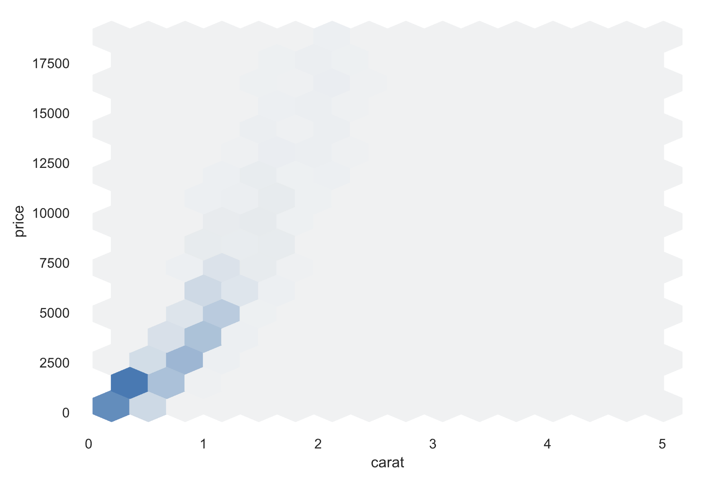

# Final Project - Diamonds 💎 are forever... but is their value? 🧐

# Overview 

Diamonds have a variety of measurable characteristics that contribute to the overall value of the diamond itself. This study is a supervised learning problem because each diamond and it's features are associated with a target price. As a group of data scientists, we are interested in analyzing the measurements and classifications of a diamond to understand the numerical value in the year 2022.

## Presentation

The presentation will outline a synopsis of what our overall project signifies. Our reasoning for topic selection, source of data, questions to answer, and data exploration/analysis can be explained below. 

### Selected topic
  - Analyzing the measurements and classifications of diamonds 
  -  Provided insight on how diamond modifications affect pricing
  -  Intended audience:
    - Jewelry appraisers (Informs consumers who want to make a purchase)
    - Raw Supplier (Mining Company)
    - Distributors (Jewelers)
    - Consumer (YOU!)
  
### Reason why they selected their topic
  - We chose this topic because it gave us a greater idea of changes for diamonds
  - Diamonds are a very good resource, and is highly demanded
  - Round cut diamonds are the most heavily requested diamond cut

### Description of their source of data
  - Link to [diamondse](https://www.diamondse.info/diamond-prices.asp)
  	-  Generation engine that allows for diamond price comparisons. You can update different features that you want (say a heart shaped, 5 carat diamond with a D color grade, the site will populate jeweler/price/etc for you)  
  - Link to [Kaggle](https://www.kaggle.com/datasets/nancyalaswad90/diamonds-prices)
	-  Diamond price CVS dataset used within our project for determine needed criteria
	-  Kaggle site was the best source that had the most features and data outlined for diamonds (round cut) within a specific time frame that we were looking for. 

### Questions they hope to answer with the data
  - Why are diamonds so expensive?
  - What is the purpose of having so many features to justify the price of a diamond?
  - How does the measurement and classifications of a diamond impact its numerical value?

### Description of the data exploration phase of the project
  - Dataset obtained from kaggle was sufficient, as each column within the dataset was crucial to our overall process
  - As a team, we aligned on using the following as model features: carat, cut, color, clarity, table_depth, table_width, x, y, and z. 
  - All of the following features in the dataset are well defined and are not dependent of each other. - get_dummies function was used to convert categorical features (cut, color, and clarity) to numerical features for model input.

### Description of the analysis phase of the project
  - The data is well formatted. 
  - It is recommended that the field 'depth' is renamed 'table_depth' for clarity.
  - It is recommended that the field 'table' is renamed 'table_width' for clarity.
  - All the features in the dataset are well delineated and independant of each other. As a team, we agree to use `carat`, `cut`, `color`, `clarity`, `table_depth`, `table_width`,`x`, `y`, and `z` as model features.
		- We utilized the sklearn.model_selection library to import then split, train and test the data. This allowed 75% of our data to be training data and 25% to be test data.
		- Utilized Oridnary Least Square to scale the features prior to modeling.
		- Linear regression is a classic method to model our dataset, and it is more understandable to our intended audience and less expensive computationally than other modeling methods.

### Technologies, languages, tools, and algorithms used throughout the project
  - Languages used: Python/Jupyter Notebook/PostgresSQL
  - Algorithm used: sklearn.model_selection, R-Squared and Ordinary Leasing Square model to scale the features and split/train/import data

### Slides Presentations are drafted in Google Slides.
Link to [Google Slides](https://docs.google.com/presentation/d/1XJpQY-igD12Sf8y8fvGjSy90BnF5JdpsV4NLWPnvuMo/edit#slide=id.g17d5b46eb50_0_244).

## Github

Through the course of this project we had to merge 4 seperate GitHub accounts. Chauntel created the repository to host the code for the final project. We aligned on naming the repository final-project. After Chauntel created the repository, she invited Graeme, Suchitra, and Matthew to collaborate. In total we had to have 17 branches and 4 commits per branch (per team member). Through this process we learned to: merge on the master branch, perform quality assurance, test the code, and navigate through merge conflicts as a team. 

### Communication
*To ensure effective communication, we aligned on availabilities early on and created a communication plan.*

### Presentation Slide Deck
## [Link to Google Slides](https://docs.google.com/presentation/d/1XJpQY-igD12Sf8y8fvGjSy90BnF5JdpsV4NLWPnvuMo/edit#slide=id.g17d5b46eb50_0_287)

Note: The descriptions and explanations required in all other project deliverables should also be in your README.md as part of your outline, unless otherwise noted. Individual Branches
### At least one branch for each team member
### Each team member has at least four commits for the duration of the third segment
(12 total commits per person)

## Machine Learning

### Provenance and schema of data 
Provisional data was obtained from the kaggle dataset [Diamonds Prices](https://www.kaggle.com/datasets/nancyalaswad90/diamonds-prices?select=Diamonds+Prices2022.csv) created by Ms. Nancy Al Aswad, which was scraped from the [Loose diamonds search engine at DiamondSearchEngine](https://www.diamondse.info/diamond-prices.asp) on July 9, 2022. The dataset contains 53,943 records of round-cut diamonds. (Round-cut diamonds represent about 72% of all diamonds listed on DiamondSE.info.) Each record has nine features (`carat`, `cut`, `color`, `clarity`, `depth`, `table`, `x`, `y`, `z`) and one target (`price`). 
- `carat` ranges from 0.2 to 5.01. 1 carat = 200 mg.
- `cut` grade has five categories: Fair, Good, Very Good, Premium, and Ideal.
- `color` has seven categories: D/E/F/G/H/I/J.
- `clarity` has eight categories: IF/VVS1/VVS2/VS1/VS2/SI1/SI2/I1. There are no flawless (FL) diamonds in this dataset.
- `depth` is the table depth which ranges from 0% to 90%.
- `table` is the table width which ranges from 0% to 90%.
- Regarding the 'depth' and 'table' features, 
please see [Understanding Diamond Table and Depth](https://www.brilliance.com/education/diamonds/depth-table?creative=617868835387&keyword=%2Bwhat%20%2Bdiamond%20%2Btable&matchtype=b&network=g&device=c&gclid=CjwKCAjw2OiaBhBSEiwAh2ZSP2pOhrNc4qaEWmpQvkH5PlLWDC-Z2_WX98YcHipvfzp_CEodbSIN4xoCM88QAvD_BwE).
- `x` is the length of the diamond in mm.
- `y` is the width of the diamond in mm.
- `z` is the depth of the diamond in mm.
- `price` is the price of the diamond in $USD set by the jeweler.

### Exploratory data analysis (EDA)

All of the EDA was done via the pandas_profiling ProfileReport module. An interactive report was generated in [EDA.ipynb](./EDA.ipynb) which provided an efficient and thorough means to explore the data set.

One of the main observations to come out of the EDA was that price varies quite linearly with carat, which suggests that linear regression with carat as a feature (and not some transformation of carat such as $carat^2$) would be worthwhile.

### Description of data preprocessing
- There are no missing values to address.
- There are zeros in x, y, and z, which can be considered missing numbers (no diamonds have a zero length, width, or depth). All y zeros have x zeros, and all x zeros have z zeros.
    - All rows (8 rows) with x zeros were removed.
    - All rows with non-zero x and y values, but zero z values (12 rows) had z values calculated: `z = (depth / 100) * (x + y) / 2`.
- Feature selection by binning occurs at this step (see details below).
- For modelling, the categorical variables need to be converted to numerical variables. Here we used the get_dummies() function, which replaces the original categorical column with as many new numerical columns as there were categories. 
    - For example, `cut` has five categories, Fair, Good, Very Good, Premium, and Ideal. The column `cut` is removed, and five new columns are added: `cut_Fair`, `cut_Good`, `cut_Very Good`, `cut_Premium`, and `cut_Ideal`. If in row `i` the original value of `cut` was Good, then in row `i` new column `cut_Good` is assigned a value of 1, and the other columns are assigned a value of 0. 
    - The categorical columns `color` and `clarity` are treated likewise.
    - In this way, the three original categorical columns are replaced by 20 new numerical columns, increasing the model feature count by 17.
- The new numerical columns generated by get_dummies() were reordered by diamond trait quality in descending order for ease of analysis.
    - `cut_Ideal`, `cut_Premium`, `cut_Very Good`, `cut_Good`, `cut_Fair`
    - `color_D`, `color_E`, `color_F`, `color_G`, `color_H`, `color_I`, `color_J`
    - `clarity_IF`, `clarity_VVS1`, `clarity_VVS2`, `clarity_VS1`, `clarity_VS2`, `clarity_SI1`, `clarity_SI2`, `clarity_I1`

### Description of feature engineering and the feature selection, including their decision making process
Initially there is no feature selection. All features (dummy variables are considered features) are included in the model, as there is no reason to exclude any feature.

There are several feature selections that can be made by binning. The purpose of binning is to reduce feature complexity in the model, removing relatively rare features by combining them together into a single category. 
- Although there are only 5 cut categories, one could bin together the two lowest frequency categories, GOOD (9.1%) and FAIR (3.0%).
- Although there are only 7 color categories, one could bin together the two highest color lowest frequency categories I (10.1%) and J (5.2%).
- Although there are only 8 clarity categories, one could bin together the two lowest frequency clarities, I1 (1.4%) and IF (3.3%), not with each other, but with their nearest clarity category. That is, bin I1 and SI2 (17.0%), and bin IF and VVS1 (6.8%).

After model training, it may be the case that some features do not contribute meaningfully to the model (see below as to how to assess significance of fit), and removal of those features may improve model performance.

### Description of how data was split into training and testing sets
In order to assess the performance of a machine learning model, all the data is split into a training set and a testing set. The two sets are mutually exclusive. The model is then trained with the training set data. The important consideration is the accuracy of predictions obtained when the trained model is exposed to unseen test data. Why?

One can choose a very flexible model that when trained fit the training data very well. In some cases one could choose a "perfect model" that passes through every training data point! However, when exposed to unseen test data, this "perfect model" does poorly at predicting unseen test data. This condition is known as overfitting.

In the end, we want a model that can most accurately predict new or unseen data.

In practice, experience has shown that the best results can be obtained by having the size of the training data set be larger than that of the test data set. Here we used the sklearn.model_selection train_test_split() function to split the data as 75% training and 25% testing.

### Data Scaling
The data in this study was not scaled for the ordinary least squares multivariate regression model.

For some machine learning models, data scaling improves model training and subsequent predictive performance.

This is not the case for ordinary least squares multivariate regression modelling. Moreover, by not scaling the data, the feature coefficients of the trained model can be used to interpret the trained model fit.

### Explanation of model choice, including limitations and benefits

The data was modelled using ordinary least-squares multivariate linear regression. The model was chosen, because the data presents a supervised learning problem (diamond price is the model target), there are no anticipated complicated patterns to the data that require a more complex/deep model, the model is well-understood, the model allows understandable predictions to be made, and the model is computationally fast. 

### Explanation of changes in model choice (if changes occurred between the Segment 2 and Segment 3 deliverables)

The choice of model did not change from last week.

### Description of how they have trained the model thus far, and any additional training that will take place

The model was trained (with the training data) on all 26 features described above with diamond `price` as the target. Two linear regression implementations were used, because each offers features that the other does not.
- The statsmodels.api OLS() function was used as it allows easy calculation of p-values for training feature coefficients.
- The sklearn.linear_model LinearRegression() function was used as it allows easy calculation of the testing $R^2$ quantity.
Both implementations gave the same interpretations of the data.

### Description of current accuracy score
There are two important considerations from the modelling. Do the features used contribute significantly to the model? What is the model accuracy?

#### *Significance of training coefficient estimates.*
Each training feature coefficient has an associated p-value. A p-value above 0.05 means the null hypothesis (the feature does not significantly contribute to the model) is not rejected.
It can be seen that every feature significantly contributes to the model except for `y` and `color_I`.

#### *Accuracy of model.*
The $R^2$ quantity is a measure of the accuracy of the model. Here the training $R^2$ is 0.920 and the testing $R^2$ is 0.921. Because the testing and training values are close, this indicated that the model did not overfit the data. One way to express the meaning of $R^2$ is that the model explains 92.1% of the variance in the testing data.

## Database
The database we decided to use was PGAdmin PGAdmin is simple to use and manipulate the needed data provided by our csv. PGAdmin allows us to have a clean and clear interface which helps us in building the necessary queries. PGAmin was chosen over other databases because it was more manageable to integrate information into and out of. 

### Database stores static data for use during the project
### Database interfaces with the project in some format (e.g., scraping updates the database, or database connects to the model)
### Database includes at least two tables (or collections, if using MongoDB)
### Database includes at least one join using the database language (not including any joins in Pandas)
### Database includes at least one connection string (using SQLAlchemy or PyMongo)
### Note: If you use a SQL database, you must provide your ERD with relationships.

- After we created a main database within PostgresSQL 11 (named "Diamonds_Price_Data"), we completed the following:
  1. We performed this function: SELECT DISTINCT * for the following features: cut, clarity, color. This function allowed 				us to get the specific, non-numerical categories with those specified columns.
    * We were able to determine that:
      - Cut column has 5 categories
      - Color column has 7 categories
      - Clarity column has 8 categories 
  2. Came to the conclusion that since cut had a higher impact on diamond price, and fewer category options, determined 					that cut would be the best choice for table comparisons. 
    - Reminder, cut choices are: Fair, Good, Very Good, Ideal, and Premium
  3. Created 5 tables, based on the cut of the diamond
  4. Used full outer join to merge together two tables: fair and premium, and good and very good. 
    * Decided to use Full Outer Join, because it would return all matching records from both tables whether the 						other tables' values completely match or not. Even though the categories have different values within the 						different features, the columns are the same (making it easier to merge). 
  5. Used connection string, SQLAlchemy to migrate our data
    * Choose SQLAlchemy because is very simple to implement and allows us to easily allow communication between 						python programs and PGAdmin. 

- Utilizing the online tool from www.quickdatabasediagrams.com for building an ER diagram, we were able to produce a schema for our single table database and used PGadmin within a postgresql database to store the data locally.
- Starting with two separate tables based on diamond numeric values (ie. carat, dimensions, price, etc) and characteristic values (ie. cut quality, color designation, and clarity designation), these tables were join, or combined, into a single full diamond data table.
- The two images below are the ERDs related to the tables create in our chosen database, PGAdmin. The tables displayed within each of the charts are centered around the "diamond_prices.csv" file. Each of the tables created are based on the cut of the diamond: fair, good, very good, ideal, and premium.
  
  
  
   Fig. This image is of the multiple tables created. Note that the primary key used is ID. 
  
  
  
   Fig. This image showcases the tables created, utilizing the outer full join 

- Taking advantage of SQLAlchemy the full table "" is pulled into the machine learning script.

## Dashboard
### Images from the initial analysis
### Data (images or report) from the machine learning task
### At least one interactive element
  
  The image above is of our dashboard which can be found at the following [link](https://public.tableau.com/views/Diamonds_price_analysis/Dashboard2?:language=en-US&:display_count=n&:origin=viz_share_link). The dashboard contains interactive tables built from the original data pre-analysis, as well as the Training and Testing R-squared figures and the coeficient table from the ML model. The tables can be adjusted through select "Cut", "Carat", or "Price".
